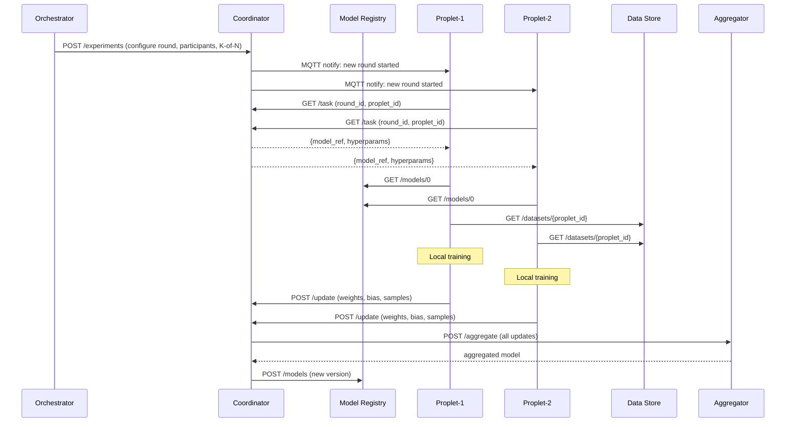

import { Steps, Step } from "fumadocs-ui/components/steps";
import { Tabs, Tab } from "fumadocs-ui/components/tabs";

This example demonstrates how to run a complete federated learning workflow using Propeller's built-in FL support. Proplets train models locally on their data, and the coordinator aggregates updates using the FedAvg algorithm.

## Overview

Propeller's federated learning system enables distributed machine learning while keeping data local to each device:



## Prerequisites

- Docker and Docker Compose
- Go 1.21+ (for building services)
- Python 3 (for provisioning script)
- SuperMQ infrastructure running

## Architecture

The FL system consists of these components:

| Component | Port | Description |
|-----------|------|-------------|
| Manager | 7070 | Orchestrates experiments and manages proplets |
| Coordinator | 8086 | Manages FL rounds and collects updates |
| Model Registry | 8084 | Stores global model versions |
| Aggregator | 8085 | Implements FedAvg aggregation |
| Data Store | 8083 | Provides local training datasets |
| Proxy | - | Fetches WASM binaries from OCI registries |

## Quick Start

<Steps>

<Step>
### Start Infrastructure

Start the SuperMQ infrastructure and FL services:

```bash
# Start SuperMQ (from propeller/docker directory)
docker compose -f docker/compose.yaml up -d

# Start FL services (from propeller/examples/fl-demo directory)
docker compose up -d model-registry aggregator local-data-store local-registry
```

Verify services are running:

```bash
docker ps --format "table {{.Names}}\t{{.Status}}\t{{.Ports}}" | grep -E "fl-demo|supermq"
```

Expected output:
```
fl-demo-local-registry     Up About an hour    0.0.0.0:5000->5000/tcp
fl-demo-aggregator         Up 2 hours          0.0.0.0:8085->8082/tcp
fl-demo-local-data-store   Up 2 hours          0.0.0.0:8083->8083/tcp
fl-demo-model-registry     Up 2 hours          0.0.0.0:8084->8081/tcp
supermq-mqtt               Up 8 hours          
```
</Step>

<Step>
### Provision SuperMQ Resources

Run the provisioning script to create domain, channel, and client credentials:

```bash
cd propeller/docker
python3 scripts/provision-smq.py
```

The script creates:
- **Domain**: Logical grouping for your FL deployment
- **Channel**: Communication channel for MQTT messages
- **Clients**: Credentials for manager, proplets, coordinator, and proxy

Example output:
```
=== Domain ===
ID: efe0e894-5147-45c8-93b2-f26bb410ca6e
Name: Propeller Domain

=== Channel ===
ID: 5e75f52f-9450-46db-853d-ed939d79bf6e
Name: Propeller Channel

=== Clients ===
Manager  - ID: 2f12f9cb-f7fa-4ee9-ab0e-e673e91e4e09, Key: 29a130aa-56b7-4ea7-a936-698bc8b29648
Proplet-1 - ID: b502023d-15cb-4239-a20a-8717177ded08, Key: 6c97f30e-d37d-45ef-a8f1-25cce31ba792
Coordinator - ID: 1a32d267-8d3c-4c1d-a188-40362d410f5a, Key: 24847d38-aa8e-4b31-bcc0-5260edebfca8
```

<Callout type="info">
The provisioning script automatically updates `docker/.env` with the new credentials.
</Callout>
</Step>

<Step>
### Start Propeller Services

Start the manager, coordinator, and proplet with the provisioned credentials:

```bash
# Build services
make manager proxy
cd proplet && cargo build --release && cd ..
cd examples/fl-demo/coordinator-http && go build -o coordinator && cd ../../..

# Start manager
export MANAGER_LOG_LEVEL=info \
  MANAGER_MQTT_ADDRESS=tcp://localhost:1883 \
  MANAGER_DOMAIN_ID=efe0e894-5147-45c8-93b2-f26bb410ca6e \
  MANAGER_CHANNEL_ID=5e75f52f-9450-46db-853d-ed939d79bf6e \
  MANAGER_CLIENT_ID=2f12f9cb-f7fa-4ee9-ab0e-e673e91e4e09 \
  MANAGER_CLIENT_KEY=29a130aa-56b7-4ea7-a936-698bc8b29648 \
  COORDINATOR_URL=http://localhost:8086
./build/manager

# Start coordinator (in another terminal)
export COORDINATOR_PORT=8086 \
  MODEL_REGISTRY_URL=http://localhost:8084 \
  AGGREGATOR_URL=http://localhost:8085 \
  MQTT_BROKER=tcp://localhost:1883 \
  MQTT_CLIENT_ID=1a32d267-8d3c-4c1d-a188-40362d410f5a \
  MQTT_USERNAME=1a32d267-8d3c-4c1d-a188-40362d410f5a \
  MQTT_PASSWORD=24847d38-aa8e-4b31-bcc0-5260edebfca8
./examples/fl-demo/coordinator-http/coordinator

# Start proplet (in another terminal)
export PROPLET_LOG_LEVEL=info \
  PROPLET_INSTANCE_ID=proplet-1 \
  PROPLET_MQTT_ADDRESS=tcp://localhost:1883 \
  PROPLET_DOMAIN_ID=efe0e894-5147-45c8-93b2-f26bb410ca6e \
  PROPLET_CHANNEL_ID=5e75f52f-9450-46db-853d-ed939d79bf6e \
  PROPLET_CLIENT_ID=b502023d-15cb-4239-a20a-8717177ded08 \
  PROPLET_CLIENT_KEY=6c97f30e-d37d-45ef-a8f1-25cce31ba792 \
  DATA_STORE_URL=http://localhost:8083 \
  MODEL_REGISTRY_URL=http://localhost:8084 \
  COORDINATOR_URL=http://localhost:8086
./proplet/target/release/proplet
```

Verify services are healthy:

```bash
curl -s http://localhost:7070/health | jq .
```

```json
{
  "status": "pass",
  "version": "v0.3.0",
  "commit": "882e5779be7126d63311d99e4b8a0c0714473f26a",
  "description": "manager service",
  "build_time": "2026-02-27T14:08:54Z",
  "instance_id": "c098706c-bd72-4c9b-a813-8314cd752e58"
}
```

```bash
curl -s http://localhost:8086/health | jq .
```

```json
{
  "status": "ok"
}
```
</Step>

<Step>
### Verify Proplet Registration

Check that the proplet registered with the manager:

```bash
curl -s http://localhost:7070/proplets | jq .
```

```json
{
  "offset": 0,
  "limit": 100,
  "total": 1,
  "proplets": [
    {
      "id": "b502023d-15cb-4239-a20a-8717177ded08",
      "name": "Aziz-Theodor",
      "task_count": 0,
      "alive": true,
      "alive_history": [
        "2026-02-27T19:12:18.960522418+03:00"
      ]
    }
  ]
}
```
</Step>

<Step>
### Initialize Model Registry

Create the initial global model (version 0):

```bash
curl -s http://localhost:8084/models | jq .
```

```json
{
  "versions": [0]
}
```

```bash
curl -s http://localhost:8084/models/0 | jq .
```

```json
{
  "b": 0,
  "version": 0,
  "w": [0, 0, 0]
}
```

The model uses a simple linear regression format with weights (`w`) and bias (`b`).
</Step>

<Step>
### Seed Training Data

Add training data for the proplet to the data store:

```bash
curl -s -X POST "http://localhost:8083/datasets/b502023d-15cb-4239-a20a-8717177ded08" \
  -H "Content-Type: application/json" \
  -d '{
    "schema": "linear_regression",
    "proplet_id": "b502023d-15cb-4239-a20a-8717177ded08",
    "data": [
      {"x": [1.0, 2.0, 1.0], "y": 10.0},
      {"x": [2.0, 1.0, 3.0], "y": 15.0},
      {"x": [3.0, 2.0, 2.0], "y": 19.0},
      {"x": [1.0, 3.0, 1.0], "y": 15.0},
      {"x": [2.0, 2.0, 2.0], "y": 17.0}
    ],
    "size": 5
  }'
```

```json
{
  "proplet_id": "b502023d-15cb-4239-a20a-8717177ded08",
  "size": 5,
  "status": "stored"
}
```
</Step>

<Step>
### Build and Push FL Client WASM

Build the FL client WASM module:

```bash
cd examples/fl-demo/client-wasm
GOTOOLCHAIN=go1.25.5 GOOS=wasip2 GOARCH=wasm go build -o fl-client.wasm fl-client.go
```

Push to your container registry:

<Tabs items={["GHCR", "Local Registry"]}>
<Tab value="GHCR">
```bash
# Login to GHCR
echo $GITHUB_TOKEN | docker login ghcr.io -u YOUR_USERNAME --password-stdin

# Push using ORAS
docker run --rm \
  -v "$(pwd):/workspace" \
  -v "$HOME/.docker/config.json:/root/.docker/config.json:ro" \
  ghcr.io/oras-project/oras:v1.2.0 \
  push ghcr.io/YOUR_USERNAME/fl-client-wasm:latest \
  fl-client.wasm:application/wasm
```
</Tab>

<Tab value="Local Registry">
```bash
# Start local registry
docker compose up -d local-registry

# Push using ORAS
docker run --rm --network host \
  -v "$(pwd):/workspace" \
  ghcr.io/oras-project/oras:v1.2.0 \
  push localhost:5000/fl-client-wasm:latest \
  fl-client.wasm:application/wasm
```

```
Copying be1b1e05784d fl-client.wasm
Copied [registry] localhost:5000/fl-client-wasm:latest
Digest: sha256:b6b571580a908fcb126c6a8fef297e59c00b6a3d9cf0a2d16acc148dc49661b5
```
</Tab>
</Tabs>
</Step>

<Step>
### Create FL Training Task

Create a federated learning task with the FL client WASM:

```bash
curl -s -X POST "http://localhost:7070/tasks" \
  -H "Content-Type: application/json" \
  -d '{
    "name": "fl-client-train",
    "kind": "federated",
    "image_url": "ghcr.io/YOUR_USERNAME/fl-client-wasm:latest",
    "env": {
      "ROUND_ID": "round-1",
      "MODEL_URI": "http://localhost:8084/models/0",
      "MODEL_REGISTRY_URL": "http://localhost:8084",
      "DATA_STORE_URL": "http://localhost:8083",
      "COORDINATOR_URL": "http://localhost:8086",
      "HYPERPARAMS": "{\"epochs\":1,\"lr\":0.01,\"batch_size\":5}"
    }
  }' | jq .
```

```json
{
  "id": "d494e314-24d6-4d09-8559-56f47f99f1ed",
  "name": "fl-client-train",
  "kind": "federated",
  "state": 0,
  "image_url": "ghcr.io/YOUR_USERNAME/fl-client-wasm:latest",
  "env": {
    "COORDINATOR_URL": "http://localhost:8086",
    "DATA_STORE_URL": "http://localhost:8083",
    "HYPERPARAMS": "{\"epochs\":1,\"lr\":0.01,\"batch_size\":5}",
    "MODEL_REGISTRY_URL": "http://localhost:8084",
    "MODEL_URI": "http://localhost:8084/models/0",
    "ROUND_ID": "round-1"
  },
  "daemon": false,
  "encrypted": false,
  "created_at": "2026-02-27T19:22:46.324890646+03:00",
  "priority": 50
}
```
</Step>

<Step>
### Start the FL Task

Start the training task:

```bash
curl -s -X POST "http://localhost:7070/tasks/d494e314-24d6-4d09-8559-56f47f99f1ed/start" | jq .
```

```json
{
  "started": true
}
```

Monitor task status:

```bash
curl -s "http://localhost:7070/tasks/d494e314-24d6-4d09-8559-56f47f99f1ed" | jq '{id, name, state, proplet_id}'
```

```json
{
  "id": "d494e314-24d6-4d09-8559-56f47f99f1ed",
  "name": "fl-client-train",
  "state": 2,
  "proplet_id": "b502023d-15cb-4239-a20a-8717177ded08"
}
```

Task states:
- `0` - Pending
- `1` - Scheduled
- `2` - Running
- `3` - Completed
- `4` - Failed
</Step>

</Steps>

## Experiment Configuration API

For more complex FL experiments with multiple participants and K-of-N aggregation, use the experiment configuration API:

```bash
curl -s -X POST "http://localhost:7070/fl/experiments" \
  -H "Content-Type: application/json" \
  -d '{
    "experiment_id": "exp-001",
    "round_id": "round-1",
    "model_ref": "http://localhost:8084/models/0",
    "participants": [
      "b502023d-15cb-4239-a20a-8717177ded08",
      "proplet-2-client-id",
      "proplet-3-client-id"
    ],
    "hyperparams": {
      "epochs": 5,
      "lr": 0.01,
      "batch_size": 32
    },
    "k_of_n": 2,
    "timeout_s": 300,
    "task_wasm_image": "ghcr.io/YOUR_USERNAME/fl-client-wasm:latest"
  }' | jq .
```

```json
{
  "experiment_id": "exp-001",
  "round_id": "round-1",
  "status": "configured"
}
```

### Experiment Parameters

| Parameter | Type | Description |
|-----------|------|-------------|
| `experiment_id` | string | Unique identifier for the experiment |
| `round_id` | string | Current round identifier |
| `model_ref` | string | URI to the global model in model registry |
| `participants` | string[] | List of proplet CLIENT_IDs (not instance names) |
| `hyperparams` | object | Training hyperparameters passed to FL client |
| `k_of_n` | int | Minimum updates required to complete round |
| `timeout_s` | int | Maximum seconds to wait for updates |
| `task_wasm_image` | string | OCI registry URL for FL client WASM |

## FL Client Environment Variables

The FL client WASM receives these environment variables:

| Variable | Description |
|----------|-------------|
| `ROUND_ID` | Current federated learning round identifier |
| `MODEL_URI` | URI to the current global model |
| `MODEL_REGISTRY_URL` | Base URL of the model registry service |
| `DATA_STORE_URL` | Base URL of the local data store service |
| `COORDINATOR_URL` | Base URL of the FL coordinator service |
| `HYPERPARAMS` | JSON-encoded training hyperparameters |
| `ML_BACKEND` | ML backend hint: `standard`, `tinyml`, or `auto` |

## Model Update Format

After training, the FL client submits updates to the coordinator:

```json
{
  "round_id": "round-1",
  "proplet_id": "b502023d-15cb-4239-a20a-8717177ded08",
  "weights": [2.1, 2.9, 1.05],
  "bias": 4.95,
  "num_samples": 5,
  "format": "f32-delta"
}
```

## Monitoring

### Check Round Status

```bash
curl -s "http://localhost:8086/rounds/round-1/status" | jq .
```

```json
{
  "round_id": "round-1",
  "completed": false,
  "num_updates": 1,
  "k_of_n": 2
}
```

### View Model Updates

Check if a new model version was created after aggregation:

```bash
curl -s http://localhost:8084/models | jq .
```

```json
{
  "versions": [0, 1]
}
```

```bash
curl -s http://localhost:8084/models/1 | jq .
```

```json
{
  "b": 4.95,
  "version": 1,
  "w": [2.1, 2.9, 1.05]
}
```

## Troubleshooting

### Common Issues

<Callout type="warn">
**Task stays in "Running" state**: Ensure the proplet can reach the model registry, data store, and coordinator URLs. Check that all environment variables are correctly set.
</Callout>

<Callout type="warn">
**WASM fetch fails with 403**: For GHCR, ensure `PROXY_AUTHENTICATE=true` and valid credentials are set. For local registry, use `http://` prefix in `PROXY_REGISTRY_URL`.
</Callout>

<Callout type="warn">
**Proplet not receiving tasks**: Verify MQTT connectivity and that the proplet is subscribed to the correct channel topics.
</Callout>

### Service Logs

Check service logs for detailed error information:

```bash
# Manager logs
tail -f /tmp/manager.log

# Coordinator logs
tail -f /tmp/coordinator.log

# Proplet logs
tail -f /tmp/proplet.log

# Proxy logs
tail -f /tmp/proxy.log
```

## Next Steps

- [TEE Example](/docs/examples/tee) - Run FL with confidential computing protection
- [Architecture Guide](/docs/architecture) - Understand the full FL lifecycle
- [API Reference](/docs/api) - Complete API documentation
