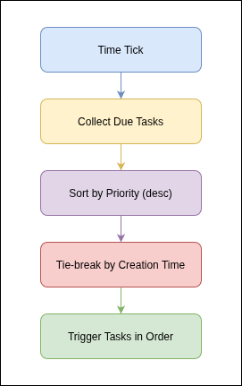
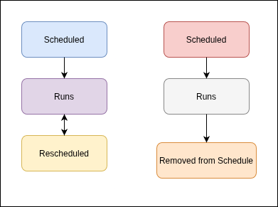

## Overview

Propeller supports **scheduled cron tasks** and **task priority scheduling**, enabling automated, time-based execution of workloads with fine-grained control over execution order.

**Scheduled cron tasks** allow you to define tasks that run automatically on a recurring or one-time basis using standard cron expressions. Instead of manually triggering tasks, you specify *when* a task should run, and the system handles the rest.

**Task priority scheduling** lets you assign a numeric priority to each task. When multiple tasks are due at the same time, higher-priority tasks execute first. This ensures that critical workloads are never delayed by less important ones.

---

## Key Concepts

### Scheduled Tasks

A scheduled task is any task with a cron expression attached to it. Once created, the system automatically triggers the task at the times defined by the cron expression. You do not need to manually start scheduled tasks - the scheduler handles execution on your behalf.



### Cron Expressions

Cron expressions define the timing of scheduled tasks using a standard five-field format:

| Field         | Allowed Values     | Special Characters |
|---------------|--------------------|--------------------|
| Minute        | 0–59               | `*` `,` `-` `/`    |
| Hour          | 0–23               | `*` `,` `-` `/`    |
| Day of Month  | 1–31               | `*` `,` `-` `/`    |
| Month         | 1–12 or JAN–DEC    | `*` `,` `-` `/`    |
| Day of Week   | 0–6 or SUN–SAT     | `*` `,` `-` `/`    |

Common patterns:

| Expression        | Meaning                             |
|-------------------|----------------------------------   |
| `* * * * *`       | Every minute                        |
| `*/5 * * * *`     | Every 5 minutes                     |
| `0 * * * *`       | Every hour, on the hour             |
| `0 0 * * *`       | Daily at midnight                   |
| `0 9 * * MON-FRI` | Weekdays at 9:00 AM                 |
| `0 0 1 * *`       | First day of each month at midnight |
| `30 14 * * *`     | Daily at 2:30 PM                    |

### Timezones

Each scheduled task can specify a timezone for cron evaluation. If no timezone is provided, it defaults to **UTC**. Use any valid IANA timezone identifier (e.g., `America/New_York`, `Europe/London`, `Asia/Tokyo`).

The cron expression is always evaluated in the context of the specified timezone. For example, a task with schedule `0 9 * * *` and timezone `America/New_York` runs at 9:00 AM Eastern Time, regardless of the server's local time.

### Recurring vs. One-Time Tasks

- **Recurring tasks** (`is_recurring: true`) are rescheduled automatically after each execution. They continue running at every matching time defined by the cron expression.
- **One-time tasks** (`is_recurring: false`) execute once at the next matching time and are then automatically removed from the schedule.



### Task Priority Levels

Priority is expressed as an integer from **0 to 100**:

| Priority Range | Suggested Use                |
|----------------|------------------------------|
| 90–100         | Critical / time-sensitive    |
| 70–89          | High priority                |
| 50–69          | Normal (default)             |
| 30–49          | Low priority                 |
| 1–29           | Background / best-effort     |

The default priority is **50**. Higher numbers mean higher priority.

### How Priority Affects Execution Order

When multiple tasks are due at the same time, the system:

1. Sorts all due tasks by priority in **descending** order (highest first).
2. If two tasks have the same priority, the **older task** (by creation time) runs first.
3. Tasks are triggered in this sorted order.

All due tasks will eventually execute - priority only determines the **order**, not whether a task runs.

---

## How to Use

### Creating a Scheduled Task

To create a scheduled task, send a `POST` request to `/tasks` with the scheduling fields included:

```json
{
  "name": "Daily Database Backup",
  "schedule": "0 2 * * *",
  "timezone": "America/Chicago",
  "is_recurring": true,
  "priority": 80,
  "image_url": "oci://registry.example.com/db-backup:latest"
}
```

**Fields:**

| Field          | Required | Description                                                    |
|----------------|----------|----------------------------------------------------------------|
| `name`         | Yes      | A descriptive name for the task                                |
| `schedule`     | No       | A valid 5-field cron expression                                |
| `timezone`     | No       | IANA timezone for cron evaluation (default: `UTC`)             |
| `is_recurring` | No       | `true` for recurring, `false` for one-time (default: `false`)  |
| `priority`     | No       | Integer 0–100 (default: `50`)                                  |
| `image_url`    | Yes      | The container image to run                                     |

The system validates the cron expression at creation time and rejects invalid expressions with a descriptive error message.

### Updating a Scheduled Task

To change a task's schedule, timezone, or priority, send a `PUT` request to `/tasks/{taskID}`:

```json
{
  "schedule": "0 3 * * *",
  "priority": 90
}
```

Only include the fields you want to change. The system automatically recalculates the next run time when the schedule is updated.

### Removing a Schedule

To stop a task from running on a schedule, update it with an empty schedule:

```json
{
  "schedule": ""
}
```

This removes the task from the scheduler without deleting the task itself.

### Viewing Task Schedule Details

Send a `GET` request to `/tasks/{taskID}` to see scheduling information:

```json
{
  "id": "a1b2c3d4-...",
  "name": "Daily Database Backup",
  "schedule": "0 2 * * *",
  "next_run": "2026-02-13T08:00:00Z",
  "is_recurring": true,
  "timezone": "America/Chicago",
  "priority": 80,
  "state": "pending"
}
```

The `next_run` field shows the next scheduled execution time in UTC.

### Deleting a Scheduled Task

Send a `DELETE` request to `/tasks/{taskID}`. This removes the task from the scheduler and deletes it entirely.

### What Happens When Multiple Tasks Are Due

When the scheduler detects several tasks that are all due at the same time:

1. All due tasks are collected.
2. They are sorted by priority (highest first), with creation time as a tiebreaker.
3. Tasks are triggered in that order.

No task is skipped - priority determines execution order, not eligibility.

### What Happens on Failure

- **Recurring tasks:** If execution fails, the task is rescheduled for its next occurrence. It will continue to run on schedule despite individual failures.
- **One-time tasks:** If execution fails, the task is removed from the schedule (same as a successful one-time execution).
- **Scheduler resilience:** If one task fails, the scheduler logs the error and continues processing the remaining due tasks. A single failure never halts the scheduler.

### Startup and Recovery

When the system restarts:

- All scheduled tasks are reloaded from storage.
- Tasks whose scheduled time has already passed are recalculated to the next future occurrence — they are **not** retroactively triggered for missed runs.
- The scheduler begins checking for due tasks within approximately one minute of startup.

---

## Examples

### Run a Cleanup Job Every Day at Midnight

```json
{
  "name": "Temp File Cleanup",
  "schedule": "0 0 * * *",
  "timezone": "UTC",
  "is_recurring": true,
  "priority": 30,
  "image_url": "oci://registry.example.com/cleanup:latest"
}
```

A low-priority recurring task that cleans up temporary files daily. Because it is low priority, it yields to more urgent tasks if they happen to be due at the same time.

### Run a High-Priority Billing Job Every 5 Minutes

```json
{
  "name": "Process Pending Charges",
  "schedule": "*/5 * * * *",
  "timezone": "America/New_York",
  "is_recurring": true,
  "priority": 95,
  "image_url": "oci://registry.example.com/billing:latest"
}
```

A critical recurring task that processes billing charges frequently. Its high priority ensures it runs before any other tasks due at the same time.

### Schedule a Low-Priority Background Report

```json
{
  "name": "Weekly Analytics Report",
  "schedule": "0 6 * * MON",
  "timezone": "Europe/London",
  "is_recurring": true,
  "priority": 25,
  "image_url": "oci://registry.example.com/analytics:latest"
}
```

A weekly report that runs every Monday at 6:00 AM London time. Its low priority means it defers to more important workloads.

### One-Time Migration Task

```json
{
  "name": "Schema Migration v42",
  "schedule": "0 3 15 2 *",
  "timezone": "UTC",
  "is_recurring": false,
  "priority": 85,
  "image_url": "oci://registry.example.com/migrate:v42"
}
```

A one-time high-priority task scheduled for 3:00 AM UTC on February 15. After execution, it is automatically removed from the schedule.

### Multiple Tasks at the Same Time with Different Priorities

Consider three tasks all scheduled for `0 0 * * *` (midnight UTC):

| Task                   | Priority | Execution Order |
|------------------------|----------|-----------------|
| Process Invoices       | 90       | 1st             |
| Sync Inventory         | 60       | 2nd             |
| Generate Usage Report  | 30       | 3rd             |

All three run at midnight, but invoices are processed first, inventory sync second, and reporting last.

---

## Use Cases

### Background Processing

Schedule long-running data transformations, ETL pipelines, or batch processing jobs to run during off-peak hours with low priority so they do not compete with user-facing workloads.

### Data Synchronization

Keep external systems in sync by scheduling periodic data pulls or pushes. Use moderate priority to balance timeliness against other workloads.

### Notifications and Alerts

Run notification digests or alert checks on a recurring schedule. Assign high priority to ensure users receive timely alerts.

### Billing and Financial Processing

Schedule frequent billing runs (e.g., every 5 minutes) at high priority to minimize payment processing delays.

### Maintenance Jobs

Automate log rotation, cache clearing, temporary file cleanup, and database vacuuming as low-priority recurring tasks.

### Time-Sensitive vs. Non-Urgent Workloads

Use priority to create a natural separation between critical and background work. For example, a real-time fraud detection scan at priority 95 always runs before a nightly analytics export at priority 20, even if both are due at the same moment.

---

## Best Practices

### Choose Appropriate Priority Levels

- Reserve priorities above 90 for truly critical tasks (billing, security, alerts).
- Use the default (50) for most tasks — only deviate when there is a clear reason.
- Avoid assigning every task a high priority. If everything is high priority, nothing is.

### Write Safe Cron Expressions

- Start with less frequent schedules and increase frequency only if needed. Running a task every minute (`* * * * *`) creates significant load.
- Prefer specific times over wildcards. `0 2 * * *` (once daily) is safer than `*/1 * * * *` (every minute).
- Stagger task schedules to avoid clustering. Instead of scheduling five tasks at `0 0 * * *`, spread them across `0 0`, `5 0`, `10 0`, etc.

### Avoid Overload

- Be mindful of how many tasks are scheduled at the same time. Large bursts of simultaneous due tasks may cause delays for lower-priority items.
- If a task takes longer than its scheduling interval (e.g., a job that takes 10 minutes but is scheduled every 5 minutes), consider increasing the interval.

### Design Idempotent Tasks

- Scheduled tasks should be safe to run multiple times without causing unintended side effects.
- Use unique identifiers, deduplication checks, or upsert logic within your task to handle cases where a task might be triggered more than once.
- This is especially important for one-time tasks — design them so that running them twice produces the same result as running them once.

### Use Timezones Intentionally

- Always specify a timezone for tasks that are sensitive to local business hours (e.g., end-of-day reports, business-hours notifications).
- Use UTC for tasks where the specific local time does not matter (e.g., periodic data syncs, cleanup jobs).
- Remember that daylight saving time transitions can shift execution times if you use a timezone that observes DST.

### Plan for Failures

- Recurring tasks automatically retry on their next scheduled occurrence. Design your tasks to handle partial state from a previous failed run.
- Monitor task execution logs for repeated failures — a task that fails silently on every run wastes resources without providing value.
- Consider adding health checks or alerting for critical scheduled tasks.
